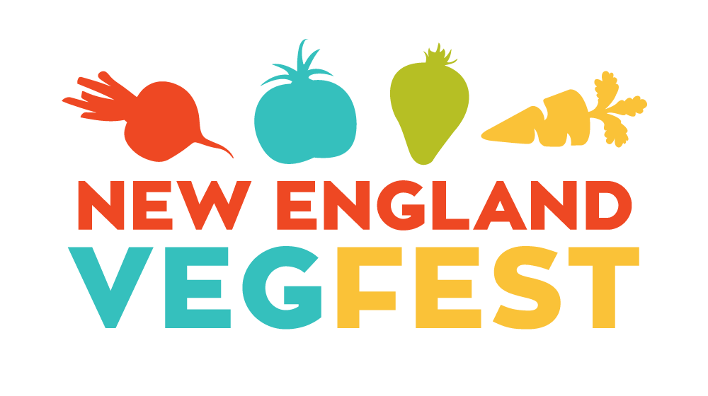

NEVegFest
=========

Website for the [New England VegFest](https://NewEnglandVegFest.com)

# Tech stack
This is a WordPress website, hosted on Dreamhost. This repo is the canonical source.

# How to make changes

There are two ways to make changes to this website. If you are changing content on the site, you need to do that by logging into the WordPress admin panel: https://NewEnglandVegFest.com/wp-admin/ You will need to have a login for that. If you are changing something in the design or structure of a template, you need to  make those changes here. Below is a more detailed explanation of how to do that.

## Making changes to this code base

Follow these steps to make changes to the code base.

1. Fork [the original repo](https://github.com/gopperman/NEVegfest).
1. Clone your fork locally.
1. Make any changes locally.
1. Commit and push your changes to your forked repo.
1. On github, send a pull request to the original repo.
1. @gopperman or @drewrwilson will review & merge.
1. After merging into the main repo, either @gopperman or @drewrwilson will need to ssh into the dreamhost account and update the code there by running `git pull origin master`.
1. Check [NewEnglandVegFest.com](https://NewEnglandVegFest.com) for your changes.
